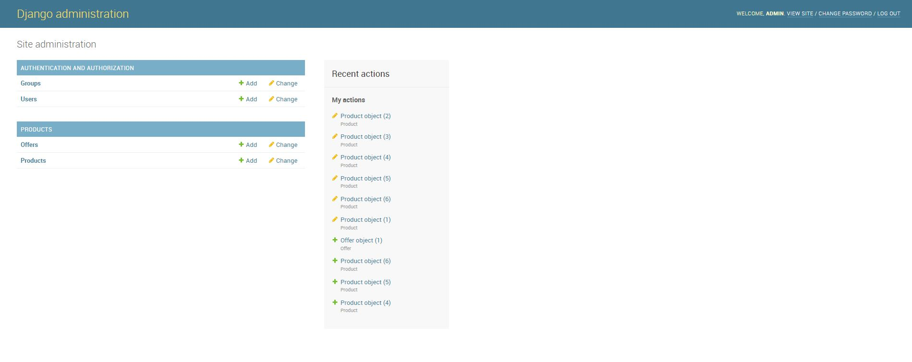
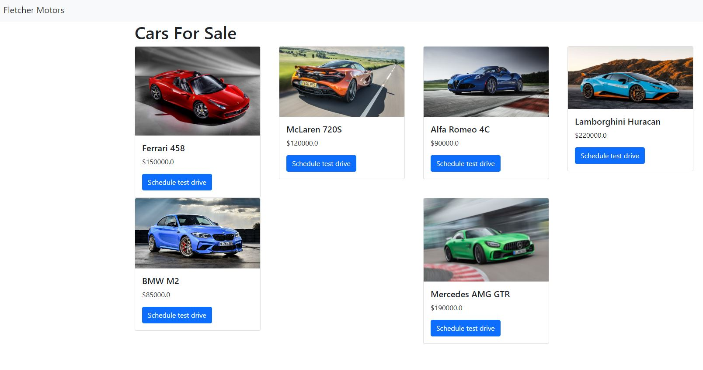

# first-django-webpage

## First webpage I've made using the Python web framework Django
### Used Django framework with Bootstrap navigation bar and card additions, and inline CSS for small formatting.

### The design is fairly crude but the main goal was to manage to get a webpage up and running with visuals, using Django
### Used the provided admin page to create product objects to autofill table properties created

### Final product

